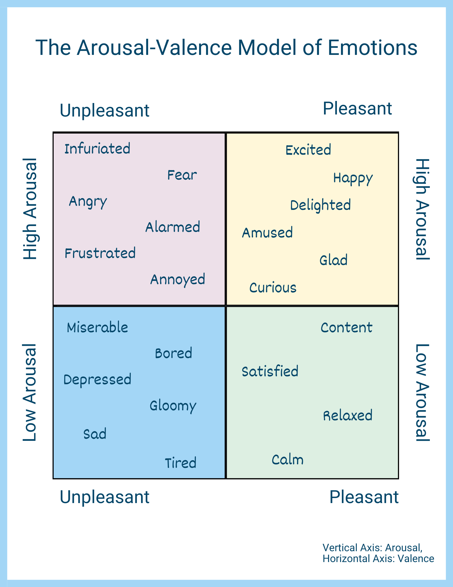
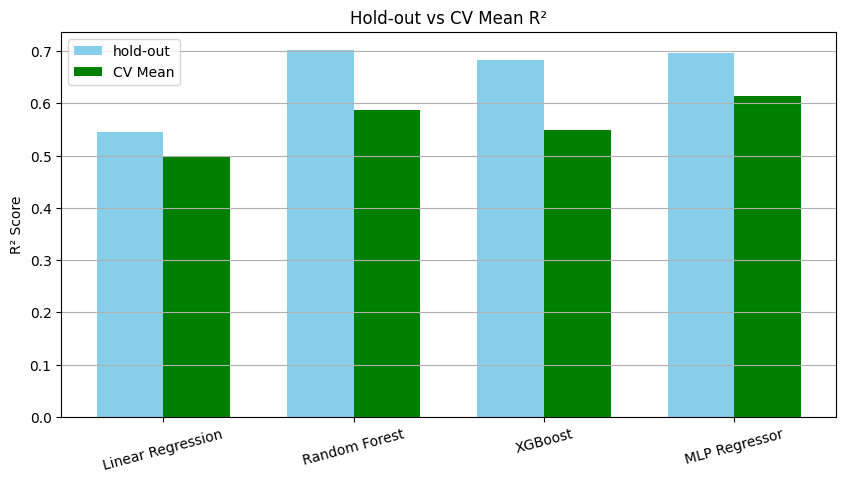
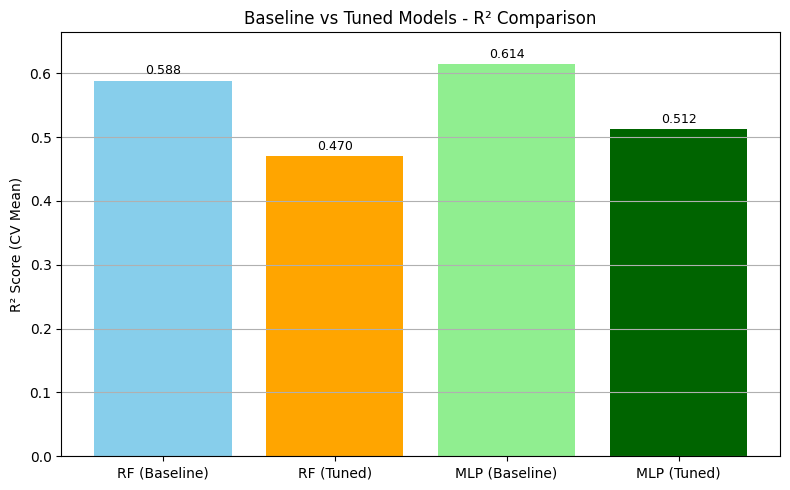
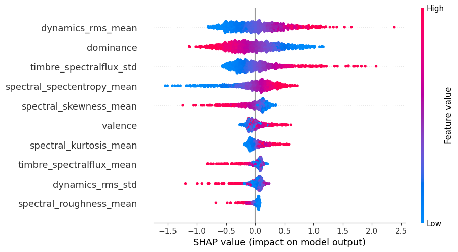

# Emotion Arousal Prediction from Audio using Explainable AI

This project predicts **arousal** (a measure of emotional intensity) from audio-derived features using machine learning models, and explains the predictions using SHAP (SHapley Additive exPlanations). The goal is to build arousal targeted AI model and explain the importance of the feature impacts.

*Figure 1: Arousal‑Valence emotion model (source: Neurodivergent Insights¹)*

---

## Project Overview

- **Task**: Regression — predict arousal levels from acoustic features
- **Input**: 75+ features extracted from audio data (e.g., MFCCs, energy, pitch)
- **Target**: Arousal (continuous emotion intensity score)
- **Tech Stack**: Python, Scikit-learn, XGBoost, SHAP, Google Colab

---

## Workflow Summary

1. **EDA**
   - Used correlation heatmaps and scatter plots to explore feature relationships
   - Selected top 10 features based on Pearson correlation

2. **Modeling**
   - Built and compared 4 regression models:
     - Linear Regression
     - Random Forest
     - XGBoost
     - MLP Regressor
   - Tuned Random Forest (`n_estimators`, `max_depth`) and MLP (`hidden_layer_sizes`, `activation`) with GridSearchCV
   - Selected MLP as final model based on R² performance

3. **Interpretability**
   - Applied SHAP to explain saved best MLP predictions
   - Visualized global feature importance using SHAP beeswarm plots
   - Identified top 3 features with highest contribution to arousal

4. **Engineering**
   - Modularized code into:
     - `src/data_utils.py` for preprocessing and feature selection
     - `src/model_utils.py` for modeling
     - `src/shap_utils.py` for SHAP computation and ranking
   - Trained and evaluated model in Google Colab
   - Saved final pipeline with `joblib`

---

## 📁 Project Structure
emotion-arousal-prediction-from-audio-explainable-AI/
├── notebook/
│ ├── emotion_dataset_eda.ipynb # EDA: correlation, heatmaps, scatter plots, feature selection
│ ├── arousal_prediction.ipynb # Model building & comparision
│ └── shap_analysis.ipynb # SHAP explanation, important and high impact features toward target prediction
├── src/
│ ├── data_utils.py # EDA functions
│ └── model_utils.py # modeling functions
| └── shap_utils.py # shap explaination functions
├── models/
│ └── baseline_mlp_pipeline.pkl # Final saved model
├── data/ # datasets
│ └── emotion_data.csv
├── README.md

## Model R² Score Comparison
The bar chart below compares the R² performance of four regression models trained on the selected audio features.  
MLP Regressor demonstrated the best generalization performance.

*Figure 2: Bar chart comparing model R² scores across holdout and cross-validation*

## Baseline vs Tuned Model Performance
Despite tuning, both Random Forest and MLP did not outperform their default configurations.
This highlights the importance of dataset size when applying complex models or hyperparameter search.

Based on these findings, the default MLP configuration was selected as the final model for SHAP interpretation and deployment.

*Figure 3: Tuning had minimal impact on R² performance in this dataset*

## SHAP Summary Plot
This plot shows the top 10 features contributing to arousal level predictions made by the MLP Regressor.  
The higher the SHAP value, the more impact the feature has on the prediction (positively or negatively).

<i>Figure 4: SHAP beeswarm plot showing top feature contributions to arousal prediction</i>

---

## 📚 References

- Abri, F. et al. *A Comparative Analysis of Modeling and Predicting Perceived and Induced Emotions in Sonification*. [MDPI link](https://www.mdpi.com/2079-9292/10/20/2519)

- ¹ Neff, M.A. *Using the Arousal–Valence Model to Better Your Emotional Intelligence*. [neurodivergentinsights.com](https://neurodivergentinsights.com/arousal-valence-model/)

